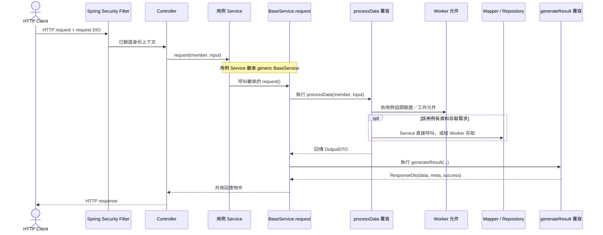

# 產險 API 請求處理流程

以下呈現 Controller、繼承式 Service 與共用 `BaseService` 的實際呼叫方式；各用例的協作者不同。

```mermaid
sequenceDiagram
    actor Client as HTTP Client
    participant Filter as Spring Security Filter
    participant Controller
    participant Service as 用例 Service
    participant Base as BaseService.request
    participant Process as processData 覆寫
    participant Worker as Worker 元件
    participant Store as Mapper / Repository
    participant Build as generateResult 覆寫

    Client->>Filter: HTTP request + request DIO
    Filter->>Controller: 已驗證身份上下文
    Controller->>Service: request(member, input)
    Note over Service,Base: 用例 Service 繼承 generic BaseService
    Service->>Base: 呼叫繼承的 request()
    Base->>Process: 執行 processData(member, input)
    Process->>Worker: 依用例協調驗證／工作元件
    opt 該用例有資料存取需求
        Process->>Store: Service 直接呼叫，或經 Worker 存取
    end
    Process-->>Base: 回傳 OutputDTO
    Base->>Build: 執行 generateResult(...)
    Build-->>Base: ResponseDto(data, meta, success)
    Base-->>Controller: 共用回應物件
    Controller-->>Client: HTTP response
```

車險與旅平險中的具體 Controller、Service 依賴示例，請見[API 分層案例](https://github.com/highhao/vehicle-travel-insurance-api)。
