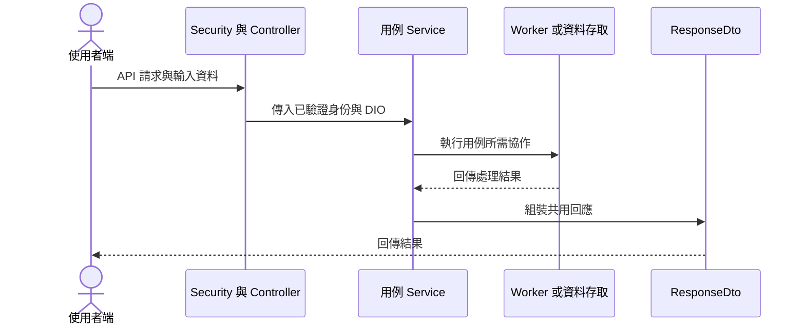

# 產險 API 請求流程

```mermaid
sequenceDiagram
    actor Client as 使用者端
    participant API as Security 與 Controller
    participant Service as 用例 Service
    participant Worker as Worker 或資料存取
    participant Response as ResponseDto

    Client->>API: API 請求與輸入資料
    API->>Service: 傳入已驗證身份與 DIO
    Service->>Worker: 執行用例所需協作
    Worker-->>Service: 回傳處理結果
    Service->>Response: 組裝共用回應
    Response-->>Client: 回傳結果
```

各端點的協作者依用例而異；本圖呈現共通請求結構，不代表每個端點都呼叫 Worker 或資料庫。
